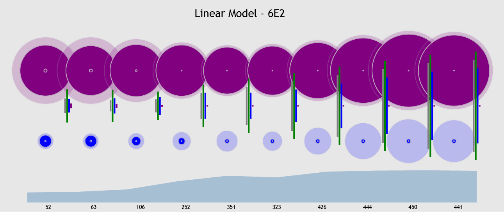
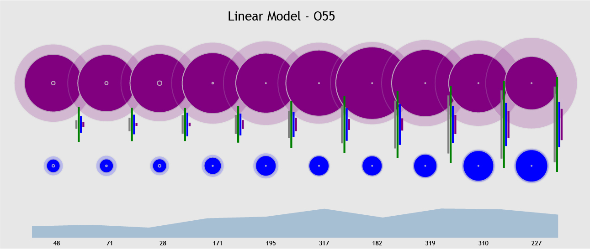
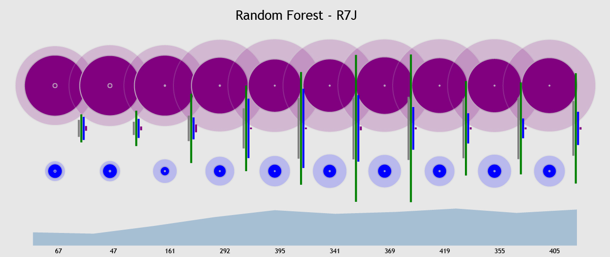
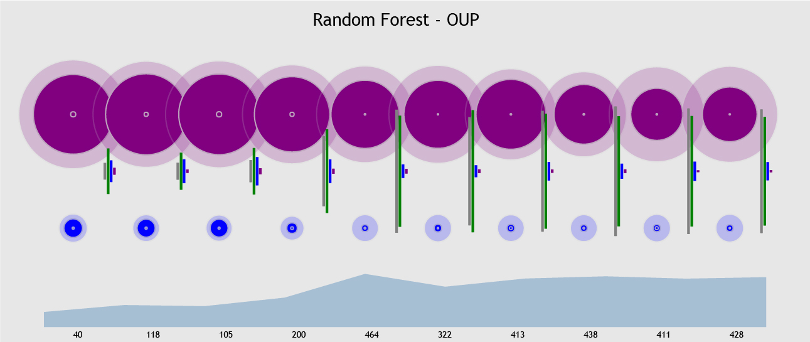

# bigValley 
## Play God, in Python

created by Seth Green, based on an exercise in *Eloquent Javascript* by Marijn Haverbeke

Big Valley is a little simulated ecosystem with three kinds of critters: grass, rabbits, and wolves. Grass grows on rocks, and then is eaten by rabbits. Rabbits, in turn, are eaten by wolves. As each year passes, each critter does one of three things:
    1) reproduces, if she has enough energy
    2) eats food, if it's next to her, increasing her energy
    3) moves, if there's no food next to her, decreasing her energy

Visit [this page](https://seth127.github.io/bigValley/) to watch the world in action. The movements of the critters are visualized, and some statistics about their evolution are plotted. The world runs until either wolves or rabbits go extinct, and then regenerates in a new **epoch**.

## Learning
The real point of this exercise is to design a process whereby the world could itself learn the ideal parameters which lead to the most stable ecosystem. This is an example of what is generally called [Agent-based modeling](https://en.wikipedia.org/wiki/Agent-based_model). There are several languages and libraries designed for doing this kind of simulation and modeling, notably [NetLogo](https://ccl.northwestern.edu/netlogo/) and [Arena](https://www.arenasimulation.com/support/entry/solving-agent-based-problems-with-arena). However, in order to have maximum control over how the parameters were set and then reset throughout the learning process, bigValley was built from scratch in Python.

Two approaches were tested for learning the optimal parameters. The first is a more traditional [Response Surface Methodology](https://en.wikipedia.org/wiki/Response_surface_methodology) approach, fitting a first-degree polynomial linear model, and then adjusting each parameter by a fixed learning rate in the direction of the relevant coefficient. The second utilized a Random Forest model, which selected an optimal set of parameters from a set of randomly generated options. More about both methods and the results are below. But first, a brief overview of the parameters that we are optimizing.

You can read in **Brief Documentation** (at the bottom of this README) about how to run the Python scripts that actually generate the simulations. It is not complicated, but for the purpose of the above visualization, several simulations have already been run pre-loaded for you. The arguments and parameters are also discussed in the documentation at the bottom.

### Parameters
Each new critter is generated with some small random variation (encoded in the `bigValley...` file) centered on the hard-coded parameter for that critter. Then, when critters reproduce, the variation of the new critter is centered on the value of it's parent. This creates some degree of "inheritance" or "evolution" as the world ages.

**Energy** is the starting energy for that critter

**Repro** is the threshold of energy that must be reached for that critter to reproduce

**Fatigue** is the amount of energy that critter loses each turn it moves (without eating)

*Note:* Grass and rocks don't have meaningful fatigue values because they don't move. They gain a little energy each turn until they reproduce or, in the case of grass, get eaten. The number of rocks does not change within each iteration (i.e. rocks don't reproduce *or* get eaten).

There were **a total of ten parameters** which were set at the beginning of each epoch. The first six were *Energy*, *Repro*, and *Fatigue* for both wolves and rabbits (referred to below as *wolfEn*, *wolfRe*, *wolfFa*, etc.). The other four were the number of wolves, rabbits, grass, and rocks that exist at the start of that epoch.

*Note:* Several learning rates and modeling hyperparameter settings were tried until an optimal setting was found for both the Linear Model and Random Forest. For brevity's sake, only the results of the optimal models are discussed below.

###Initial Training Runs
Before each test run, 25 epochs of the world were run with parameters centered around the starting statistics noted in the appendix. These parameters had random normal noise added to them each epoch, so that some semblance of a "normal distribution" of training simulations could be generated. Additionally, the starting placement of each critter was random each time, so this added another stochastic element to each iteration. 

Once 25 epochs were run, the first *modeling iteration* began by training its model on those 25 and setting its parameters accordingly.

###Stabilization Threshold
Each epoch was set to run until either rabbits or wolves went extinct **or** until it had reached a pre-set "success" threshold (running for 500 years without an extinction, or growing to 10,000 total critters). In the examples below, 50-75 learning runs were conducted and before the summary statistics were calculated. In the plots below, each test run is identified with a 3-character alpha-numeric ID, for purposes of easier comparison between plots. The prefix **LM-** indicates that run used a Linear Model for learning, while **RF-** indicates Random Forest. 

##Response Surface Linear Model
After the initial 25 training epochs, an OLS linear model was fit with the ten parameters discussed above as the explanatory variables, and the year of the first extinction for that iteration as the response. Thus, the response was bounded, with 1 (an extinction in the first year, very unlikely) on the lower end and 500 (the max years allowed before restart) on the upper.

The default starting parameters (listed in the appendix), were then adjusted in the direction of the coefficient for that parameter. 

This process was repeated with each epoch, so that a model was fit on all 25 training iterations, *and all the previous learning epochs*, and then the starting parameters were adjusted accordingly for the next epoch. Below are visualizations of two of the linear model simulations.

###Critter Stats: Linear Model

Moving left to right, you see trends in the evolution of the ecosystem as the algorithm learns. Wolves are represented as purple and rabbits as blue. The large interior circles represent the species' starting *Energy*, while the large one around it represents the reproduction threshold (*Repro*) and the tiny inner circle represents *Fatigue*. The lines in the middle show the relative number of each creature at the beginning of each epoch. The area chart and numbers along the bottom indicate how successful those epochs were in terms of years before an extinction.

Though the traces are far from identical, some patterns emerge. For instance, in both tests, *Fatigue* for both rabbits and wolves immediately moved towards zero until it hit the minimum allowed value (set to 5 for these simulations). Likewise, both simulations increase the starting count of both grass and rocks as the learning progresses.

However, it is more interesting to note the the parameters of the wolves and rabbits move in somewhat opposite directions. `6E2` converges on a tiny number of very large wolves that reproduce easily, and a large population of tiny rabbits that need more energy before they can reproduce. On the other hand, `O55` finds a balance with a larger population of medium-sized, slower reproducing wolves, and moderate number of large rabbits that reproduce quickly.

##Random Forest Model
The Random Forest Model took an entirely different approach. Again, each test run began with 25 training iterations. Then, on *each learning iteration* a Random Forest Regressor was fit to the training data (which again included the initial 25, and *all* previous learning epochs).  At this point 100 sets of parameters were generated with random normal variation around a "center value"" for each parameter. The newly trained Regressor then predicts the year of first extinction for each of those 100 parameter sets, and chooses the one with the best predicted outcome (i.e. most years until an extinction). This "best parameter set" is then used to run the current epoch.

*Note:* These "center values" for generating the 100 options are initially set to the default values in the appendix, but once the algorithm begins learning, they are set to the values of the "best parameter set" predicted in the previous epoch. This provides for a slower movement of the parameters that explores more of the feaure space, as compared to the Linear Model approach.

###Critter Stats: Random Forest

These two are a little less distinct than the two linear modeled runs, though they do show yet another set of plausible solutions. While both opt for a small number of medium-sized wolves that reproduce fairly slowly, `OUP` actually appears to be moving towards *even smaller* wolves as it learns. Both runs converge towards rabbits that don't reproduce overly quickly, though `R7J` has a moderate number of medium-sized rabbits, while `OUP` shows a small number of tiny rabbits.

##Conclusions and Next Steps

###Looking beyond "best"
These kinds of simulations have applications in a broad array of fields, from wildlife biology to ambulance routing to modeling online communities. As opposed to finding the a single "best" set of parameters, the primary gain from an Agent-based Model such as this is the ability to explore the interactions between the parameters, and to explore what is likely a very large space of possible solutions to a given problem.

The linear modeling approach seems to converge to its optimal settings more quickly than the Random Forest. However, consider a real-world situation where certain parameters cannot simply be "turned up or down" without some great cost. Sure, it might be "better" if *grassNum* was higher, but imagine that this represents something like "the number of Red Cross food drops in a disaster area". It may not be practical to simply quadruple the number of food drop sites. In this light, Random Forests and other non-parametric models bring much to the table.

###Next steps
There are many directions that this research could go. One obvious example would be to introduce entirely new agents (for instance "super predators" to eat wolves; or perhaps a large, slower-to-reproduce herbivore to coexist with the smaller, faster rabbits). However, if there is to be any real-world gain from this kind of modeling, we must be sure not to introduce too many variables that are beyond our control.

Another interesting approach would be to set up different "continents." This would entail simulating four ecosystems simultaneously, but *far away* from each other on the grid. Eventually, the populations would expand enough to interact with each other. Observing the interactions on these borders of differently-evolved populations would be fascinating. A beta test of this can be seen by visiting the [visualization above](https://seth127.github.io/bigValley/) and clicking on the "Continents" radio button.

The limit of 500 years per epoch could also be increased. This is perhaps the easiest, and most informative, extension. The limit was imposed partially to control for outliers, but mainly to control computation time. The examples presented here took several days to simulate on a fairly small AWS EC2 instance. With more computing power, that limit could be significantly relaxed and more varied and interesting interactions might be observed. Additionally, letting the simulations run for significantly more than the 50-75 learning epochs that we show here would extremely interesting. Would they eventually converge on settings which never led to extinction? It seems possible.

### Customize
For those adventurous souls, feel free to open up the bvLife.py and create some creatures of your own. A ruminant who gets double energy from each plant eaten? A predator that hunts in packs? A carniverous plant that eats low-energy foragers? The only limit is your own imagination...

#Brief Documentation:
###Simulation Functions

`bigValleyLearningD3LM.py`: runs simulations of the world and learns the optimal parameters with the Linear Model approach, discussed above. It takes three arguments:
    1) the max number of years to run before restarting (if there has not been an extinction)
    2) the number of learning iterations to run (after the initial 500 training iterations) before quitting the program. Note, if "stability" (defined above) is reached before this number, a final epoch with max years set to 5,000 will run, and then the program will quit.
    3) either `new` to start a new test run (with 500 training iterations) or the three-character alpha-numeric of a previous test run, if you'd like to pick up where you left off. *Note:* if the previous test run has already reached "stability" then it will automatically run the 5,000 iteration and then quit.

`bigValleyLearningD3RF.py`: runs simulations of the world and learns the optimal parameters with the Random Forest approach, discussed above. Takes the same arguments as `bigValleyLearningD3LM.py`.

For both programs, a log of each year and epoch is saved in the `plotData/` folder. This then referenced by `index.html` for the visualization. Note that the visualization actually references the `plotDataLIVE/` folder. To visualize your new simulations, you must drag their data folder into `plotDataLIVE/` and then modify `index.html` to read it. In `index.html`, you must only add another radio button to reference it and increment up the count in the `checkRadio()` function to reflect the correct total of simulations in `plotDataLIVE/`.

###Helper Functions
`bvSim.py` and `bvSimLearning.py` set up each simulation and save it's output appropriately.

`bvLife.py` contains definitions of all the critters and the methods they use to act and live.

`bvWorldEvo.py` contains all the code to run each year (mostly contained in `silentTime()`). It also contains many helper functions for reproduction and eating, etc.

###Appendix

####Default Starting Parameters
*wolf stats*
Energy = 300
Repro = 400
Fatigue = 20

*rabbit stats*
Energy = 70
Repro = 100
Fatigue = 10

*numbers of each critter*
Wolves = 3
Rabbits = 16
Grass = 25
Rocks = 10
